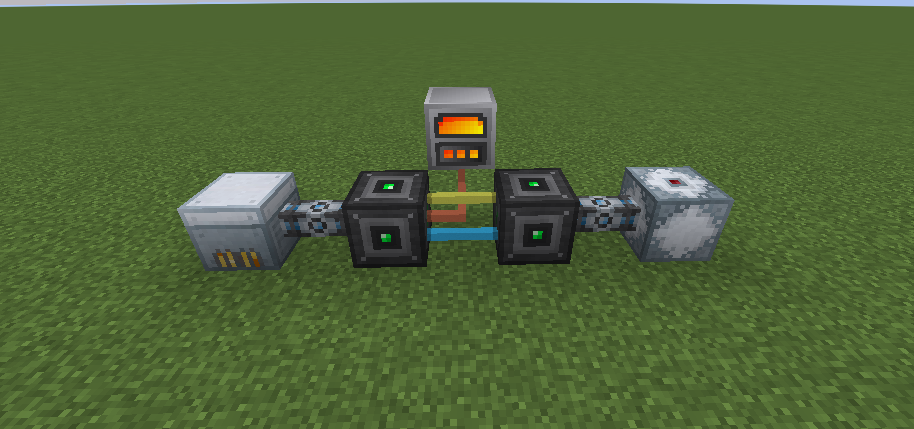
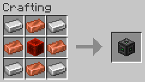

# UPC

Adds a block to convert between Tech Reborn and Modern Industrialization energy

### Usage

Converts between TR energy and MI energy both ways with 1:1 ratio

### Recipe

Substitute iron ingot with any c:iron_ingots and copper ingot with any c:copper_ingots
